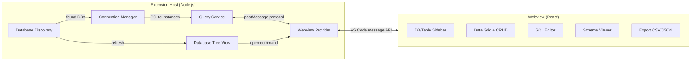

# PGlite Explorer -- VS Code / Cursor Extension

**Repository**: [https://github.com/hanzlamateen/pglite-explorer](https://github.com/hanzlamateen/pglite-explorer)

## Architecture Overview




## Tech Stack

- **Extension host**: TypeScript, `@electric-sql/pglite` for database operations
- **Webview UI**: React 19, CodeMirror 6 (SQL editor), custom data grid with `@tanstack/react-table`
- **Build**: esbuild (two pipelines: extension CJS + webview IIFE), matching [markdown-mermaid-zoom](https://github.com/hanzlamateen/markdown-mermaid-zoom) patterns
- **Test**: Mocha + `@vscode/test-electron`, VS Code extension test runner
- **CI/CD**: GitHub Actions -- `ci.yml` (build/lint/test on push/PR) + `release.yml` (publish to VS Code Marketplace + Open VSX on tag)
- **Publisher**: `EchEmLabs` (same as existing extension)

## Project Structure

```
pglite-explorer/
├── .github/workflows/
│   ├── ci.yml                        # Build, lint, test on push/PR
│   └── release.yml                   # Package + publish on tag push
├── .vscode/
│   ├── launch.json                   # Debug configs (sample workspace, current workspace, tests)
│   └── tasks.json                    # Build tasks for preLaunchTask
├── build/
│   ├── esbuild-extension.mjs         # Extension host build (CJS, Node)
│   ├── esbuild-webview.mjs           # Webview build (IIFE, browser, bundles React)
│   └── package.json                  # { "type": "module" }
├── docs/
│   └── logo.png                      # Extension marketplace icon
├── media/
│   └── icon.svg                      # Activity Bar icon
├── src/
│   ├── extension/
│   │   ├── index.ts                  # activate() / deactivate()
│   │   ├── commands.ts               # Register commands (open, openTable, refresh, addDatabase)
│   │   ├── config.ts                 # Read extension settings
│   │   ├── database/
│   │   │   ├── discovery.ts          # Auto-scan, source parsing, manual config
│   │   │   ├── connection.ts         # PGlite connection manager (open/close/cache)
│   │   │   └── query.ts             # Query execution: list tables, schema, CRUD, raw SQL
│   │   ├── views/
│   │   │   └── databaseTree.ts       # Activity Bar tree view provider
│   │   └── webview/
│   │       └── provider.ts           # WebviewPanel creation, HTML scaffold, message handling
│   ├── webview/
│   │   ├── index.tsx                 # React DOM entry point
│   │   ├── App.tsx                   # Main app shell (sidebar + content area)
│   │   ├── components/
│   │   │   ├── Sidebar.tsx           # Database selector + table list
│   │   │   ├── DataGrid.tsx          # Paginated table with sort/filter/inline edit
│   │   │   ├── AddRowDialog.tsx      # Insert new row form
│   │   │   ├── SqlEditor.tsx         # CodeMirror 6 SQL editor
│   │   │   ├── QueryResults.tsx      # SQL query results table
│   │   │   ├── SchemaViewer.tsx      # Column types, constraints, indexes
│   │   │   ├── ExportButton.tsx      # CSV/JSON export
│   │   │   └── Toolbar.tsx           # View mode tabs + actions
│   │   ├── hooks/
│   │   │   ├── useVsCodeApi.ts       # acquireVsCodeApi() wrapper
│   │   │   └── useMessaging.ts       # Send/receive messages to extension
│   │   ├── styles/
│   │   │   └── global.css            # VS Code CSS variable-based theming
│   │   └── types.ts                  # Webview-side type definitions
│   └── shared/
│       └── protocol.ts               # Message types for extension <-> webview
├── test/
│   ├── runTests.ts                   # VS Code test runner entry
│   ├── tsconfig.json                 # Test-specific TS config (excludes fixtures)
│   ├── fixtures/
│   │   ├── seed-databases.mjs        # Script to generate sample PGlite databases
│   │   └── sample-workspace/         # Sample workspace for F5 debugging
│   │       ├── app.ts                # Sample source file for detection testing
│   │       ├── ecommerce-db/         # Generated: users, products, orders, order_items
│   │       └── blog-db/              # Generated: authors, posts, comments, tags, post_tags
│   └── suite/
│       ├── index.ts                  # Mocha runner
│       ├── discovery.test.ts         # Database detection tests
│       ├── connection.test.ts        # PGlite connection tests
│       └── query.test.ts             # Query execution tests
├── spec/
│   └── architecture.md               # This file
├── .editorconfig
├── .gitignore
├── .vscodeignore
├── eslint.config.mjs
├── package.json
├── tsconfig.json
├── CHANGELOG.md
├── LICENSE
└── README.md
```

## Key Design Decisions

### 1. Database Discovery (`src/extension/database/discovery.ts`)

Three detection strategies, all run in parallel:

- **Auto-scan**: Recursively find `PG_VERSION` files in workspace (exclude `node_modules`, `.git`, `dist`). The parent directory of each `PG_VERSION` is a PGlite data directory.
- **Source parsing**: Regex scan `.ts`/`.js` files for `new PGlite('...')` and `PGlite.create('...')` patterns, resolve relative paths against the file's directory.
- **Manual config**: User-specified paths via `pgliteExplorer.databasePaths` setting (array of strings).

A `FileSystemWatcher` watches for `PG_VERSION` file creation/deletion to auto-refresh.

### 2. Connection Manager (`src/extension/database/connection.ts`)

- PGlite is single-connection, so we manage one `PGlite` instance per database path.
- Connections are created lazily on first access and cached.
- Connections are closed on deactivate or when a database is removed.
- All PGlite operations run in the extension host (Node.js).

### 3. Message Protocol (`src/shared/protocol.ts`)

Strongly typed message protocol between extension host and webview:

```typescript
// Extension -> Webview
type ExtToWebviewMessage =
  | { type: 'databases'; databases: DatabaseInfo[] }
  | { type: 'tables'; tables: TableInfo[] }
  | { type: 'tableData'; columns: ColumnMeta[]; rows: Record<string, unknown>[]; totalCount: number; page: number; pageSize: number }
  | { type: 'queryResult'; columns: ColumnMeta[]; rows: Record<string, unknown>[]; rowsAffected: number; error?: string; executionTimeMs: number }
  | { type: 'schema'; schema: TableSchema }
  | { type: 'exportReady'; data: string; format: 'csv' | 'json'; fileName: string }
  | { type: 'error'; message: string }
  | { type: 'rowInserted'; table: string }
  | { type: 'rowUpdated'; table: string }
  | { type: 'rowsDeleted'; table: string; count: number }
  | { type: 'selectDatabase'; dbPath: string; tableName?: string }

// Webview -> Extension
type WebviewToExtMessage =
  | { type: 'listDatabases' }
  | { type: 'listTables'; dbPath: string }
  | { type: 'getTableData'; dbPath: string; table: string; page: number; pageSize: number; orderBy?: string; orderDir?: 'ASC' | 'DESC'; where?: string }
  | { type: 'insertRow'; dbPath: string; table: string; row: Record<string, unknown> }
  | { type: 'updateRow'; dbPath: string; table: string; pk: Record<string, unknown>; changes: Record<string, unknown> }
  | { type: 'deleteRows'; dbPath: string; table: string; pks: Record<string, unknown>[] }
  | { type: 'executeQuery'; dbPath: string; sql: string }
  | { type: 'getSchema'; dbPath: string; table: string }
  | { type: 'exportData'; dbPath: string; table: string; format: 'csv' | 'json' }
  | { type: 'refreshDatabases' }
```

### 4. Webview UI (Drizzle Studio-inspired)

Full editor-tab webview built with React 19, closely following the Drizzle Studio UX.

#### Layout

```
+-------------------------------------------------------------------+
| Tab Bar: [Data]  [SQL Editor]  [Schema]       [Export v] [Refresh] |
+-------------+-----------------------------------------------------+
| Sidebar     | Action Bar: [+ Add Row] [Delete Selected]  [Filter] |
|             |-----------------------------------------------------|
| [DB ▼]      | Filter: column [=] value                    [Apply] |
|             |-----------------------------------------------------|
|  * users    | [x] | id | name       | email          | created_at |
|  * orders   | [ ] | 1  | Alice      | alice@test.com | 2025-01-01 |
|  * products | [ ] | 2  | Bob        | bob@test.com   | 2025-01-02 |
|             | [ ] | 3  | Charlie    | charlie@t...   | 2025-01-03 |
|             |-----------------------------------------------------|
|             | Showing 1-50 of 128 rows       [< Prev] [Next >]    |
+-------------+-----------------------------------------------------+
| Status: Connected to ./my-db  |  3 tables  |  users (128 rows)    |
+-------------------------------------------------------------------+
```

#### Drizzle Studio-inspired interactions

- **Spreadsheet-like data grid**: rows and columns displayed like a table/spreadsheet
- **Double-click to edit**: double-click any cell to enter edit mode; Enter saves, Escape cancels
- **Column resizing**: drag column borders to resize
- **Column sorting**: click column header to sort ascending/descending
- **Filter bar**: sits above the grid; filter by column, operator, and value
- **Row selection**: checkbox column on the left for selecting rows
- **Add row**: "+" button opens a form dialog with fields for each column, respecting NOT NULL and defaults
- **Delete rows**: select rows via checkboxes, then click "Delete Selected" to remove
- **Pagination**: bottom bar shows current range, total count, and prev/next navigation
- **SQL editor tab**: CodeMirror 6 editor with PostgreSQL syntax; results displayed in a table below
- **Schema tab**: table columns with types, nullable, defaults, constraints, and indexes

#### Additional features beyond Drizzle Studio

- **Database selector**: dropdown in sidebar to switch between multiple detected PGlite databases
- **Export**: export current table data as CSV or JSON
- **Theme integration**: VS Code CSS variables (`--vscode-editor-background`, `--vscode-foreground`, etc.) for native light/dark mode

### 5. Extension Settings (`package.json` contributes.configuration)

- `pgliteExplorer.databasePaths`: `string[]` -- manually configured DB paths
- `pgliteExplorer.autoDetect`: `boolean` (default: true) -- enable auto-scan
- `pgliteExplorer.sourceDetect`: `boolean` (default: true) -- enable source code parsing
- `pgliteExplorer.excludePatterns`: `string[]` -- glob patterns to exclude from scanning
- `pgliteExplorer.pageSize`: `number` (default: 50) -- rows per page in data grid

### 6. Activity Bar Tree View (`src/extension/views/databaseTree.ts`)

A `DatabaseTreeProvider` implements `vscode.TreeDataProvider` to show databases and tables in the Activity Bar:

- **View container**: `pgliteExplorerContainer` with a database icon (`media/icon.svg`)
- **View**: `pgliteExplorerDatabases` inside the container
- **Welcome view**: Shown when no databases are detected, with "Add Database" and "Refresh" buttons
- **Tree structure**: `DatabaseItem` (collapsible, shows detection method) -> `TableItem` (leaf, opens table in webview)
- Clicking a database runs `pgliteExplorer.open` with the database path
- Clicking a table runs `pgliteExplorer.openTable` with the database path and table name
- Discovery changes automatically refresh the tree via `onDidChange`

### 7. Commands

- `pgliteExplorer.open` -- Open PGlite Explorer panel (accepts optional `dbPath`)
- `pgliteExplorer.openTable` -- Open PGlite Explorer focused on a specific table (accepts `dbPath` and `tableName`)
- `pgliteExplorer.refresh` -- Refresh database list and tree view
- `pgliteExplorer.addDatabase` -- Manually add a database path via folder picker

### 8. Testing Strategy

- **Unit tests** (`test/suite/discovery.test.ts`): Create temp directories with `PG_VERSION` files, verify discovery finds them. Create mock TS files with `new PGlite('./db')` patterns, verify source parsing extracts paths.
- **Connection tests** (`test/suite/connection.test.ts`): Create a real PGlite database in temp dir, connect via the connection manager, verify tables can be queried.
- **Query tests** (`test/suite/query.test.ts`): Populate a PGlite database with test data, exercise all query service methods (list tables, get schema, CRUD, raw SQL, export).
- All tests run in VS Code Extension Development Host via `@vscode/test-electron`.

### 9. Sample Databases & Debugging

The `test/fixtures/seed-databases.mjs` script generates two PGlite databases for development and testing:

- **ecommerce-db**: `users`, `products`, `orders`, `order_items` -- with foreign keys and realistic data
- **blog-db**: `authors`, `posts`, `comments`, `tags`, `post_tags` -- with timestamps, text content, and many-to-many relationships

Run with `npm run seed`. The generated databases live in `test/fixtures/sample-workspace/` and are `.gitignore`'d.

`.vscode/launch.json` provides three debug configurations:

1. **Run Extension** -- Opens the sample workspace so seeded databases appear immediately
2. **Run Extension (Current Workspace)** -- Opens whichever workspace is currently active
3. **Extension Tests** -- Runs the Mocha test suite in the Extension Development Host

### 10. CI/CD (mirrors markdown-mermaid-zoom)

- **ci.yml**: On push to `main` and PRs -- install, lint, build, compile tests, run tests (with `xvfb` for headless VS Code).
- **release.yml**: On tag push (`v*`) -- build, test, `vsce package`, publish to VS Code Marketplace (`VSCE_PAT`), publish to Open VSX (`OVSX_PAT`), upload VSIX to GitHub Release.

### 11. Key Dependencies

**Runtime** (bundled into extension):

- `@electric-sql/pglite` -- PGlite database engine

**Runtime** (bundled into webview):

- `react`, `react-dom` -- UI framework
- `@tanstack/react-table` -- data grid
- `@codemirror/view`, `@codemirror/state`, `@codemirror/lang-sql`, `@codemirror/commands`, `@codemirror/language`, `@codemirror/autocomplete` -- SQL editor

**Dev**:

- `@types/vscode`, `@types/react`, `@types/react-dom`, `@types/mocha`, `@types/node`
- `@vscode/test-electron`, `@vscode/vsce`
- `esbuild`, `typescript`, `eslint`, `typescript-eslint`, `mocha`, `npm-run-all`
