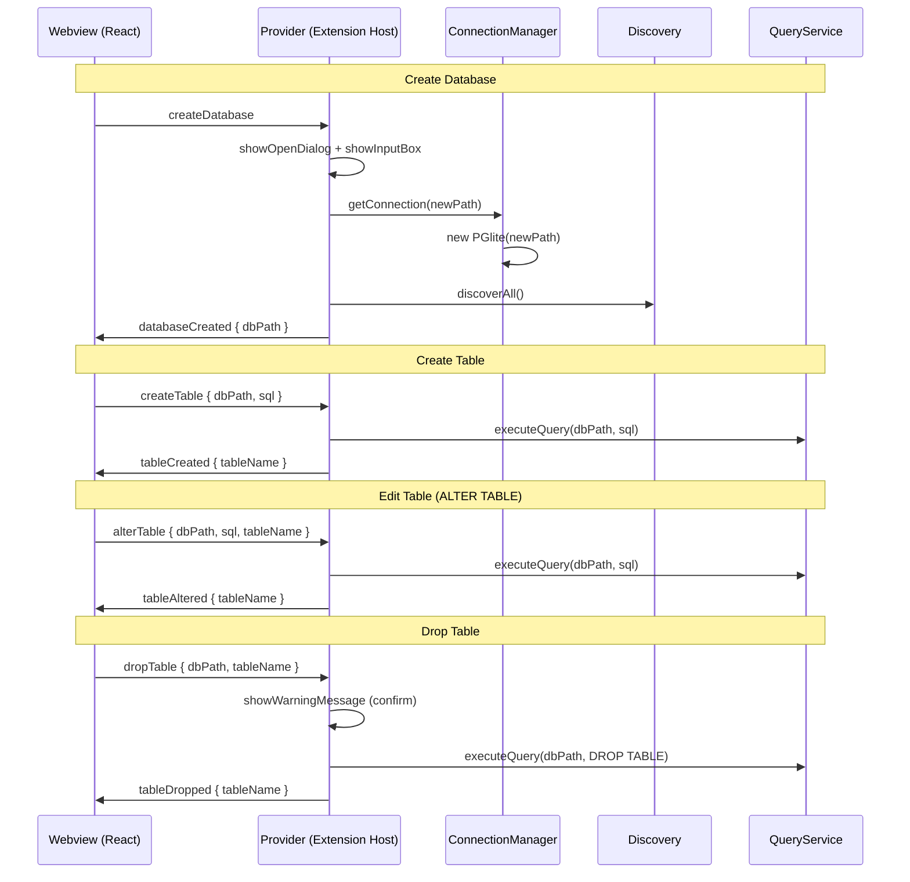
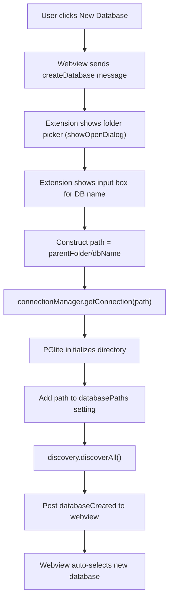
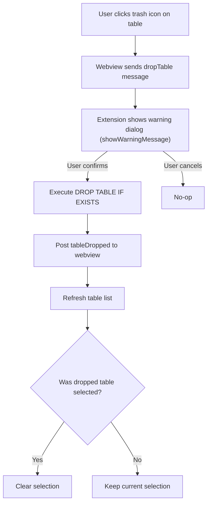

# Create Database, Create Table & Edit Table -- Feature Spec

Extends PGlite Explorer with full database and table lifecycle management -- including complete constraint support (Primary Key, Foreign Key, Unique, Check, Indexes) -- so users never need to leave the extension.

## Scope

| Feature | Description |
|---------|-------------|
| **Create Database** | Initialize a new PGlite database directory from the UI |
| **Create Table** | Visual form with columns + full constraint builder (PK, FK, Unique, Check, Indexes) |
| **Edit Table** | ALTER TABLE operations + add/drop constraints and indexes via diff-based editor |
| **Drop Table** | Remove a table with confirmation |

## Architecture -- New Message Flow



## Protocol Changes (`src/shared/protocol.ts`)

New message types added to the existing typed union:

```typescript
// Webview -> Extension (additions)
| { type: 'createDatabase' }
| { type: 'createTable'; dbPath: string; sql: string }
| { type: 'alterTable'; dbPath: string; sql: string; tableName: string }
| { type: 'dropTable'; dbPath: string; tableName: string }

// Extension -> Webview (additions)
| { type: 'databaseCreated'; dbPath: string }
| { type: 'tableCreated'; tableName: string }
| { type: 'tableAltered'; tableName: string }
| { type: 'tableDropped'; tableName: string }
```

## Feature 1: Create New Database

PGlite auto-initializes a database directory when `new PGlite(path)` is called on a path that doesn't contain an existing database. We leverage this behavior.

### Entry Points

- **Webview sidebar**: "+ New Database" button next to the Database dropdown in `Sidebar.tsx`
- **Command palette / tree view title**: `pgliteExplorer.createDatabase` command

### Flow



### Files Changed

- `src/shared/protocol.ts` -- Add `createDatabase` and `databaseCreated` message types
- `src/extension/webview/provider.ts` -- Handle `createDatabase`: folder picker, input box, PGlite init, discovery refresh
- `src/extension/commands.ts` -- Register `pgliteExplorer.createDatabase` command
- `package.json` -- Add command entry + view title menu contribution
- `src/webview/components/Sidebar.tsx` -- Add "+ New" button next to Database label
- `src/webview/App.tsx` -- Handle `databaseCreated` message, auto-select new DB

## Feature 2: Create Table (Visual Form with Full Constraints)

### UI Design

A modal dialog (`CreateTableDialog.tsx`) with two main sections: **Columns** and **Constraints**.

```
+-----------------------------------------------------------------------+
| Create New Table                                                  [×]  |
|-----------------------------------------------------------------------|
| Table name: [________________________]                                 |
|                                                                        |
| == Columns ==                                                          |
| ┌──────────┬──────────┬────┬──────┬────────┬─────────────┬──────────┐ |
| │ Name     │ Type     │ PK │ NULL │ Unique │ Default     │          │ |
| ├──────────┼──────────┼────┼──────┼────────┼─────────────┼──────────┤ |
| │ [id    ] │ [serial▼]│ [✓]│ [ ]  │ [ ]    │ [         ] │ [Remove] │ |
| │ [name  ] │ [text  ▼]│ [ ]│ [ ]  │ [ ]    │ [         ] │ [Remove] │ |
| │ [email ] │ [text  ▼]│ [ ]│ [✓]  │ [✓]    │ [         ] │ [Remove] │ |
| │ [price ] │ [numer.▼]│ [ ]│ [ ]  │ [ ]    │ [0        ] │ [Remove] │ |
| └──────────┴──────────┴────┴──────┴────────┴─────────────┴──────────┘ |
|                                                      [+ Add Column]   |
|                                                                        |
| == Constraints ==                                         [collapsed]  |
| ┌────────────────────────────────────────────────────────────────────┐ |
| │ ▸ Composite Primary Key    [columns: ▼ multi-select]               │ |
| │                                                                    │ |
| │ ▸ Foreign Keys                                         [+ Add FK] │ |
| │   FK1: [user_id ▼] → [users ▼].[id ▼]  ON DELETE [CASCADE ▼]  [🗑]│ |
| │                                                                    │ |
| │ ▸ Unique Constraints                                [+ Add Unique] │ |
| │   UQ1: columns [email, username ▼]                              [🗑]│ |
| │                                                                    │ |
| │ ▸ Check Constraints                                 [+ Add Check]  │ |
| │   CK1: name [price_positive] expr [price > 0        ]          [🗑]│ |
| │                                                                    │ |
| │ ▸ Indexes                                           [+ Add Index]  │ |
| │   IDX1: name [idx_email] columns [email ▼] unique [✓]          [🗑]│ |
| └────────────────────────────────────────────────────────────────────┘ |
|                                                                        |
| == SQL Preview ==                                                      |
| ┌────────────────────────────────────────────────────────────────────┐ |
| │ CREATE TABLE "orders" (                                            │ |
| │   "id" serial PRIMARY KEY,                                         │ |
| │   "name" text NOT NULL,                                            │ |
| │   "email" text UNIQUE,                                             │ |
| │   "price" numeric NOT NULL DEFAULT 0,                              │ |
| │   CONSTRAINT "fk_user" FOREIGN KEY ("user_id")                     │ |
| │     REFERENCES "users" ("id") ON DELETE CASCADE,                   │ |
| │   CONSTRAINT "uq_email_username" UNIQUE ("email", "username"),     │ |
| │   CONSTRAINT "price_positive" CHECK (price > 0)                    │ |
| │ );                                                                 │ |
| │ CREATE INDEX "idx_email" ON "orders" ("email");                    │ |
| └────────────────────────────────────────────────────────────────────┘ |
|                                                                        |
|                                      [Cancel]  [Create Table]          |
+------------------------------------------------------------------------+
```

### Supported PostgreSQL Types

The type dropdown offers common types grouped by category:

- **Numeric**: `integer`, `bigint`, `smallint`, `serial`, `bigserial`, `real`, `double precision`, `numeric`
- **Text**: `text`, `varchar(255)`, `char(1)`
- **Boolean**: `boolean`
- **Date/Time**: `date`, `timestamp`, `timestamptz`, `time`
- **JSON**: `json`, `jsonb`
- **Other**: `uuid`, `bytea`

Note: `serial` / `bigserial` are PostgreSQL's auto-increment types (they create an implicit sequence + set the default to `nextval()`).

### Column-Level Properties

Each column row supports:

| Property | Control | Notes |
|----------|---------|-------|
| Name | Text input | Required |
| Type | Dropdown (grouped) | See type list above |
| Primary Key | Checkbox | Mutually exclusive with Composite PK in constraints section |
| Not Null | Checkbox | Unchecked = nullable |
| Unique | Checkbox | Single-column unique constraint |
| Default | Text input | Raw SQL expression (e.g. `now()`, `0`, `'active'`) |

### Table-Level Constraints

The collapsible constraints section supports:

| Constraint | UI Controls | SQL Output |
|-----------|-------------|------------|
| Composite Primary Key | Column multi-select dropdown | `PRIMARY KEY ("col1", "col2")` |
| Foreign Key | Source col dropdown, ref table dropdown, ref col dropdown, ON DELETE dropdown, ON UPDATE dropdown | `CONSTRAINT "name" FOREIGN KEY ("col") REFERENCES "table" ("col") ON DELETE action ON UPDATE action` |
| Multi-column Unique | Constraint name + column multi-select | `CONSTRAINT "name" UNIQUE ("col1", "col2")` |
| Check Constraint | Constraint name + SQL expression input | `CONSTRAINT "name" CHECK (expr)` |
| Index | Index name + column multi-select + unique toggle | `CREATE [UNIQUE] INDEX "name" ON "table" ("col1", "col2")` |

### SQL Generation

The dialog generates:
1. A `CREATE TABLE` statement with all inline and table-level constraints
2. Separate `CREATE INDEX` statements (indexes cannot be inline in CREATE TABLE)

All SQL is concatenated and sent via the `createTable` message. The extension host executes it and returns `tableCreated`.

### Files Changed

- `src/shared/protocol.ts` -- Add `createTable` and `tableCreated` message types
- `src/extension/webview/provider.ts` -- Handle `createTable`: execute SQL (may split multi-statement), post `tableCreated`
- `src/webview/components/CreateTableDialog.tsx` -- **New file**: modal form with columns + constraints sections
- `src/webview/components/Sidebar.tsx` -- Add "+ Create Table" button in Tables section
- `src/webview/App.tsx` -- Wire dialog state, pass `tables` list for FK picker, handle `tableCreated`
- `src/webview/styles/global.css` -- Column builder rows, constraint section, collapsible sections

## Feature 3: Edit Table (ALTER TABLE with Full Constraint Management)

### UI Design

An `EditTableDialog.tsx` modal with three sections: **Columns**, **Constraints**, and **Indexes**. Loads the current schema and tracks all changes as diffs. Generates the minimal set of ALTER TABLE / CREATE INDEX / DROP INDEX statements.

```
+-----------------------------------------------------------------------+
| Edit Table: users                                                 [×]  |
|-----------------------------------------------------------------------|
| Table name: [users___________________] (rename generates ALTER TABLE)  |
|                                                                        |
| == Columns ==                                                          |
| ┌──────────┬──────────┬──────┬─────────────┬──────────────────────┐   |
| │ Name     │ Type     │ NULL │ Default     │ Actions              │   |
| ├──────────┼──────────┼──────┼─────────────┼──────────────────────┤   |
| │ id       │ integer  │ [ ]  │ nextval(..) │ (primary key)        │   |
| │ [name  ] │ [text  ▼]│ [ ]  │ [         ] │ [🗑 Drop Column]     │   |
| │ [email ] │ [text  ▼]│ [✓]  │ [         ] │ [🗑 Drop Column]     │   |
| │ [phone ] │ [text  ▼]│ [✓]  │ [         ] │ ★ NEW                │   |
| └──────────┴──────────┴──────┴─────────────┴──────────────────────┘   |
|                                                      [+ Add Column]   |
|                                                                        |
| == Constraints ==                                                      |
| ┌────────────────────────────────────────────────────────────────────┐ |
| │ Existing:                                                          │ |
| │  FK  fk_order_user: user_id → users.id ON DELETE CASCADE    [🗑]   │ |
| │  UQ  uq_email: (email)                                     [🗑]   │ |
| │  CK  ck_price: price > 0                                   [🗑]   │ |
| │                                                                    │ |
| │ Add new:                                                           │ |
| │  [+ Foreign Key]  [+ Unique]  [+ Check]                           │ |
| │                                                                    │ |
| │ ┌─ New Foreign Key ──────────────────────────────────────────────┐ │ |
| │ │ Name: [fk_cat]  Column: [cat_id ▼]  → Table: [categories ▼]  │ │ |
| │ │ Ref Column: [id ▼]  ON DELETE: [SET NULL ▼]  ON UPDATE: [▼]   │ │ |
| │ │                                                  [Add] [Cancel]│ │ |
| │ └───────────────────────────────────────────────────────────────-┘ │ |
| └────────────────────────────────────────────────────────────────────┘ |
|                                                                        |
| == Indexes ==                                                          |
| ┌────────────────────────────────────────────────────────────────────┐ |
| │ Existing:                                                          │ |
| │  IDX  idx_email: (email) UNIQUE                             [🗑]   │ |
| │  IDX  idx_created: (created_at)                             [🗑]   │ |
| │                                                                    │ |
| │ Add new:                                                [+ Index]  │ |
| └────────────────────────────────────────────────────────────────────┘ |
|                                                                        |
| == Pending Changes (5) ==                                              |
| ┌────────────────────────────────────────────────────────────────────┐ |
| │ ALTER TABLE "users" ADD COLUMN "phone" text;                       │ |
| │ ALTER TABLE "users" ALTER COLUMN "email" DROP NOT NULL;             │ |
| │ ALTER TABLE "users" DROP CONSTRAINT "ck_price";                     │ |
| │ ALTER TABLE "users" ADD CONSTRAINT "fk_cat" FOREIGN KEY ("cat_id") │ |
| │   REFERENCES "categories" ("id") ON DELETE SET NULL;                │ |
| │ CREATE INDEX "idx_phone" ON "users" ("phone");                      │ |
| └────────────────────────────────────────────────────────────────────┘ |
|                                                                        |
|                                      [Cancel]  [Apply Changes]         |
+------------------------------------------------------------------------+
```

### Supported Column ALTER Operations

| Operation | SQL Generated |
|-----------|---------------|
| Rename table | `ALTER TABLE "old" RENAME TO "new"` |
| Add column | `ALTER TABLE "t" ADD COLUMN "col" type [NOT NULL] [DEFAULT val]` |
| Drop column | `ALTER TABLE "t" DROP COLUMN "col"` |
| Rename column | `ALTER TABLE "t" RENAME COLUMN "old" TO "new"` |
| Change type | `ALTER TABLE "t" ALTER COLUMN "col" TYPE newtype` |
| Set NOT NULL | `ALTER TABLE "t" ALTER COLUMN "col" SET NOT NULL` |
| Drop NOT NULL | `ALTER TABLE "t" ALTER COLUMN "col" DROP NOT NULL` |
| Set default | `ALTER TABLE "t" ALTER COLUMN "col" SET DEFAULT val` |
| Drop default | `ALTER TABLE "t" ALTER COLUMN "col" DROP DEFAULT` |

### Supported Constraint ALTER Operations

| Operation | SQL Generated |
|-----------|---------------|
| Add Foreign Key | `ALTER TABLE "t" ADD CONSTRAINT "name" FOREIGN KEY ("col") REFERENCES "ref" ("ref_col") ON DELETE action ON UPDATE action` |
| Drop Foreign Key | `ALTER TABLE "t" DROP CONSTRAINT "name"` |
| Add Unique | `ALTER TABLE "t" ADD CONSTRAINT "name" UNIQUE ("col1", "col2")` |
| Drop Unique | `ALTER TABLE "t" DROP CONSTRAINT "name"` |
| Add Check | `ALTER TABLE "t" ADD CONSTRAINT "name" CHECK (expression)` |
| Drop Check | `ALTER TABLE "t" DROP CONSTRAINT "name"` |
| Create Index | `CREATE [UNIQUE] INDEX "name" ON "t" ("col1", "col2")` |
| Drop Index | `DROP INDEX "name"` |

### Diff Tracking

The dialog maintains two states: the **original schema** (loaded from `getSchema`) and the **working schema** (edited by the user). On "Apply Changes", a diff function compares them and generates the minimal set of SQL statements in the correct order:

1. Drop constraints/indexes that were removed
2. Column renames (must happen before type changes that reference new names)
3. Column type changes, nullable changes, default changes
4. Drop columns
5. Add columns
6. Add new constraints/indexes
7. Table rename (last, so all column references use old table name)

### Entry Points

- **Sidebar**: Pencil (edit) icon next to each table name
- **Schema tab**: "Edit Table" button (future consideration)

### Files Changed

- `src/shared/protocol.ts` -- Add `alterTable` and `tableAltered` message types
- `src/extension/webview/provider.ts` -- Handle `alterTable`: execute multi-statement SQL, post `tableAltered`
- `src/webview/components/EditTableDialog.tsx` -- **New file**: edit table modal with columns + constraints + indexes + diff
- `src/webview/components/Sidebar.tsx` -- Add edit icon per table
- `src/webview/App.tsx` -- Wire dialog state, pass `tables` + `schema` props, handle `tableAltered`
- `src/webview/styles/global.css` -- Diff indicators, constraint list, inline add-constraint forms

## Feature 4: Drop Table

### Flow



### Files Changed

- `src/shared/protocol.ts` -- Add `dropTable` and `tableDropped` message types
- `src/extension/webview/provider.ts` -- Handle `dropTable` with confirmation + execution
- `src/webview/components/Sidebar.tsx` -- Add trash icon per table
- `src/webview/App.tsx` -- Handle `tableDropped` (refresh + clear selection if needed)

## Updated Sidebar Layout

```
+---------------------------+
| Database           [+ New]|
| [ecommerce-db         ▼] |
|                           |
| Tables        [+ Create]  |
|  ⊞ users          [✏][🗑] |
|  ⊞ products        [✏][🗑] |
|  ⊞ orders          [✏][🗑] |
|  ⊞ order_items     [✏][🗑] |
+---------------------------+
```

## Constraint Features Matrix

| Constraint | Create Table | Edit Table (Add) | Edit Table (Drop) |
|-----------|:---:|:---:|:---:|
| Single-column Primary Key | Per-column checkbox | N/A (PK change requires recreate) | N/A |
| Composite Primary Key | Column multi-select | N/A | N/A |
| Foreign Key | Source col, ref table, ref col, ON DELETE/UPDATE | Same form | Drop by constraint name |
| Unique (single column) | Per-column checkbox | Same | Drop by constraint name |
| Unique (multi-column) | Column multi-select | Same | Drop by constraint name |
| Check Constraint | Name + SQL expression | Same | Drop by constraint name |
| Index | Name + columns + unique toggle | Same | Drop by index name |
| Not Null | Per-column checkbox | ALTER SET/DROP NOT NULL | Same |
| Default Value | Per-column text input | ALTER SET/DROP DEFAULT | Same |
| Auto-increment | Select `serial` or `bigserial` type | N/A (type change) | N/A |

### ON DELETE / ON UPDATE Actions

Foreign key reference actions available in the dropdown:

| Action | Description |
|--------|-------------|
| `NO ACTION` | Default. Raises error if referenced row is deleted/updated |
| `RESTRICT` | Same as NO ACTION but checked immediately |
| `CASCADE` | Delete/update referencing rows automatically |
| `SET NULL` | Set referencing columns to NULL |
| `SET DEFAULT` | Set referencing columns to their default values |

## Updated Project Structure (New Files)

```
src/webview/components/
  ├── CreateTableDialog.tsx   # NEW -- Create table form with columns + constraints builder
  ├── EditTableDialog.tsx     # NEW -- Edit table form with ALTER TABLE diff + constraint management
  ├── AddRowDialog.tsx        # Existing -- Insert row form
  ├── Sidebar.tsx             # Modified -- New buttons and table action icons
  ├── DataGrid.tsx            # Unchanged
  ├── SqlEditor.tsx           # Unchanged
  ├── SchemaViewer.tsx        # Unchanged
  └── Toolbar.tsx             # Unchanged
```

## Commands (Updated)

| Command | Title | Source |
|---------|-------|--------|
| `pgliteExplorer.open` | Open PGlite Explorer | Existing |
| `pgliteExplorer.openTable` | Open Table in Explorer | Existing |
| `pgliteExplorer.refresh` | Refresh Databases | Existing |
| `pgliteExplorer.addDatabase` | Add Database Path | Existing |
| `pgliteExplorer.createDatabase` | Create New Database | **New** |

## README Update

After implementation, update `README.md` to reflect:

- **Features section**: Add "Create databases", "Create tables with full constraint support (PK, FK, Unique, Check, Indexes)", "Edit table structure and constraints", "Drop tables"
- **Usage section**: Add "Creating Databases", "Creating Tables", "Editing Tables" subsections with examples
- **Project Structure**: Add `CreateTableDialog.tsx` and `EditTableDialog.tsx` to the tree

## Summary of All Files Changed

- `src/shared/protocol.ts` -- 8 new message types
- `src/extension/webview/provider.ts` -- 4 new message handlers (with multi-statement SQL support)
- `src/extension/commands.ts` -- 1 new command registration
- `package.json` -- 1 new command + menu contribution
- `src/webview/components/CreateTableDialog.tsx` -- **New file** (columns + constraints + indexes + SQL preview)
- `src/webview/components/EditTableDialog.tsx` -- **New file** (schema diff + constraint management + SQL preview)
- `src/webview/components/Sidebar.tsx` -- Buttons + table action icons
- `src/webview/App.tsx` -- Dialog state + 4 new message handlers + pass tables/schema for FK picker
- `src/webview/styles/global.css` -- Column builder, constraint sections, collapsible UI, diff indicators
- `README.md` -- Feature documentation update
